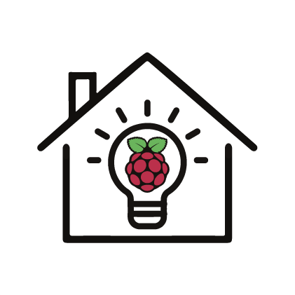

# homeautomation

Hobby project for making smart-control in my apartment.

For now it can only control lights, but will be continued.

## Lights

The ceiling lights are [Trådfri](https://www.ikea.com/dk/da/p/tradfri-led-paere-e27-250-lumen-tradlos-kan-daempes-varm-glod-globe-brunt-klart-glas-70455676/) from Ikea. The chain light is a christmas decoration, which is set up all year. The desk lamp is a simple desk lamp. The Ikea Trådfri is controlled by transistors emulating button presses on the [remote](https://www.ikea.com/dk/da/p/tradfri-tradlos-lysdaemper-hvid-70408595/). The desk and chain light are controlled with two relays.
